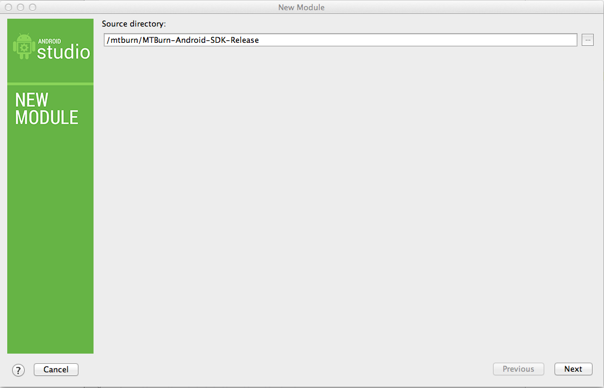
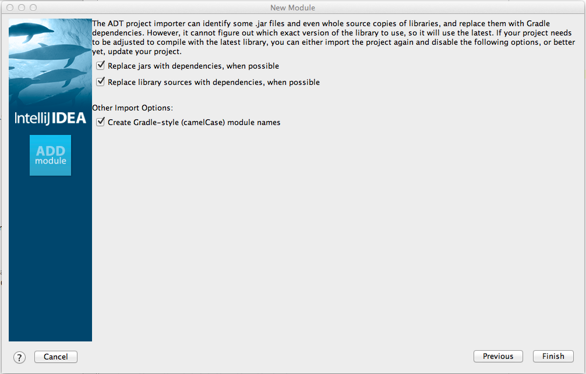

# 目次

* [対応環境](#support)
* [MTBurn-Android-SDKをダウンロード](#dl)
* [Eclipse への導入](#eclipse)
	* [MTBurn-Android-SDK ライブラリの追加](#eclipse/android-sdk)
	* [GooglePlayServiceライブラリの追加](#eclipse/google-play-service)
* [Android Studioへの導入](#android-studio)
	* [MTBurn-Android-SDK ライブラリの追加](#android-studio/android-sdk)
	* [GooglePlayServiceライブラリの追加](#android-studio/google-play-service)
* [ウォール広告とアイコン広告について](#wall_icon)

本ドキュメントは MTBurn-Android-SDK を Eclipse または Android Studio のプロジェクトに追加し、実際に使える所までを記したものです。

<a name="support"></a>
#対応環境

動作する **Android のSDKVersionは 8 以上**になります。

お困りの際は以下のサポートまで一報ください。

[a@mtburn.com](a@mtburn.com)

<a name="dl"></a>
#MTBurn-Android-SDKをダウンロード

以下の URL から AppDavis Android SDK をダウンロードします。最新のバージョンを選択することを推奨します。

[AppDavis Android SDK をダウンロード](https://github.com/mtburn/MTBurn-Android-SDK-Install-Guide/releases)

ダウンロードが完了したら、取得した zip ファイルを解凍して SDK ライブラリを確認して下さい。

```
MTBurn-Android-SDK-Release
```

また、デモアプリを試す場合は、demo ディレクトリを import してください。

下記の説明に沿ってMTBurn-Android-SDKライブラリとGooglePlayServicerライブラリを追加することで SDK の各種機能を確認することが出来ます。

<a name="eclipse"></a>
#Eclipseへの導入

<a name="eclipse/android-sdk"></a>
###MTBurn-Android-SDKライブラリの追加

- 1.Existing Android Code into Workspaceを選択。

- 2.次へを選択。


- 3.ルート・ディレクトリの参照で、ダウンロードした MTBurn-Android-SDK-Release を選択後、完了。


- 4.MTBurn-Android-SDK を使用するプロジェクトのプロパティを開き、
MTBurn-Android-SDK-Release ライブラリを追加。

- 5.OKを選択。


<a name="eclipse/google-play-service"></a>
###GooglePlayServiceライブラリの追加

- 1.Existing Android Code into Workspaceを選択。

- 2.次へを選択。


- 3.ルート・ディレクトリの参照で、android-sdk/extras/google/google_play_services/libproject/google-play-services_lib　を選択後、完了。


- 4.MTBurn-Android-SDK を使用するプロジェクトのプロパティを開き、
google-play-services_libのライブラリを追加。
 - バージョンは 4.0 以上であれば問題ありません

- 5.OKを選択。


以上で Eclipse への導入は完了です。

<a name="android-studio"></a>
#AndroidStudioへの導入

<a name="android-studio/android-sdk"></a>
###MTBurn-Android-SDKライブラリの追加

- 1.File -> Import Module を選択。

- 2.ソース・ディレクトリの参照で、ダウンロードした MTBurn-Android-SDK-Release を選択後、Next。


- 3.チェックマークを確認後、完了。


- 4.MTBurn-Android-SDK を使用するプロジェクトの app/build.gradle の dependencies 配下に、
`compile project(":mTBurnAndroidSDKRelease")` を追加。

- 5.Sync Projects with Gradle Files を実行。

<a name="android-studio/google-play-service"></a>
###GooglePlayServiceライブラリの追加

- 1.Google Play services SDK をまだインストールしていない場合は [SDK Manager からインストールする](http://developer.android.com/google/play-services/setup.html)。

- 2.MTBurn-Android-SDK を使用するプロジェクトの app/build.gradle の dependencies 配下に、
`compile 'com.google.android.gms:play-services:6.1.+'` を追記する
 - バージョンは 4.0 以上であれば問題ありません

- 3.MTBurn-Android-SDK を使用するプロジェクトの app/build.gradle の android, defaultConfig 配下の
`minSdkVersion` を 9 に修正する

- 4.Sync Projects with Gradle Files を実行。

以上で Android Studio への導入は完了です。

<a name="wall_icon"></a>
#ウォール広告とアイコン広告について

次のアップデートよりウォール広告とアイコン広告の API の削除を予定しております。

すでに実装されている SDK への影響はありませんが、広告案件の減少が予想されます。

`JavaScript SDK` を使ってアイコン広告を実装する選択肢が用意されております。管理画面より広告タグを発行して使うことができます。
