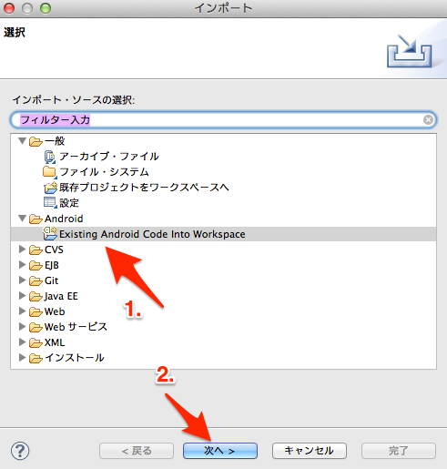
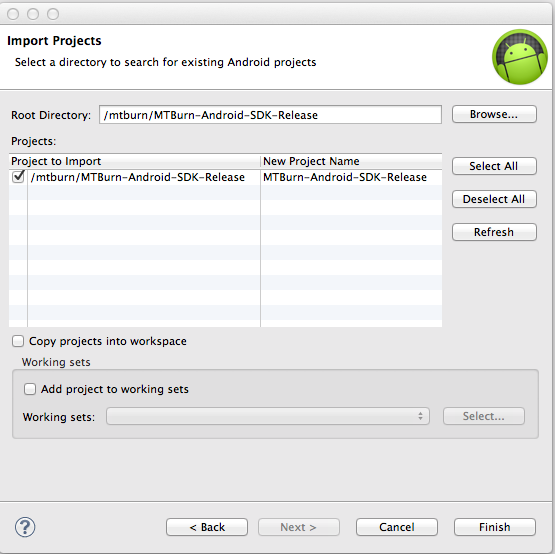
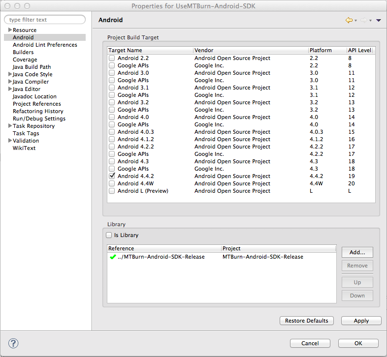
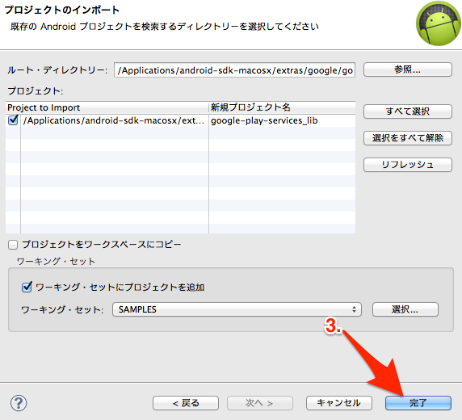
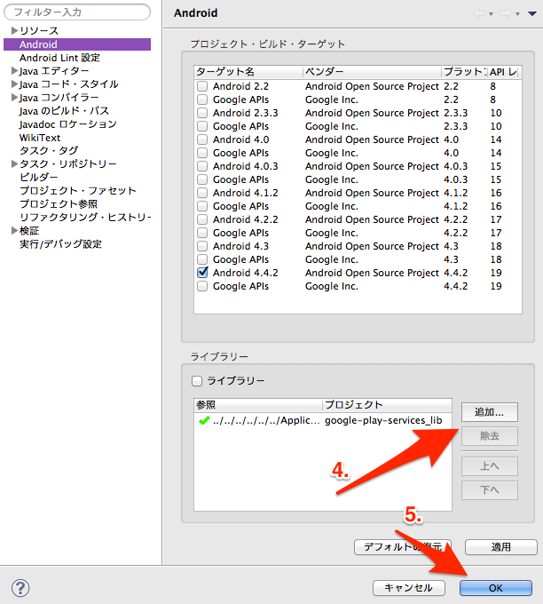

# 目次

* [対応環境](#対応環境)
* [MTBurn-Android-SDKをダウンロード](#MTBurn-Android-SDKをダウンロード)
* [MTBurn-Android-SDK ライブラリの追加](#MTBurn-Android-SDKライブラリの追加)
* [GooglePlayServiceライブラリの追加](#GooglePlayServiceライブラリの追加)

本ドキュメントは MTBurn-Android-SDK を Eclipse のプロジェクトに追加し、実際に使える所までを記したものです。

#対応環境

動作する **Android のSDKVersionは 8 以上**になります。

お困りの際は以下のサポートまで一報ください。

[a@mtburn.com](a@mtburn.com)

#MTBurn-Android-SDKをダウンロード

以下の URL から MTBurn-Android-SDK-Release をダウンロードします。

| 更新日時 | バージョン | リンク | 変更点 |
| --- | --- | --- | --- |
| 20140901 | v1.0.7 |  [ダウンロード]() | - | 

ダウンロードが完了したら、取得した zip ファイルを解凍して以下の MTBurn-Android-SDK ライブラリを確認して下さい。

```
MTBurn-Android-SDK-Release
```

#MTBurn-Android-SDKライブラリの追加

- 1.Existing Android Code into Workspaceを選択。

- 2.次へを選択。


- 3.ルート・ディレクトリの参照で、ダウンロードした MTBurn-Android-SDK-Release を選択後、完了。


- 4.MTBurn-Android-SDK を使用するプロジェクトのプロパティを開き、
MTBurn-Android-SDK-Release ライブラリを追加。

- 5.OKを選択。



#GooglePlayServiceライブラリの追加

- 1.Existing Android Code into Workspaceを選択。

- 2.次へを選択。


- 3.ルート・ディレクトリの参照で、android-sdk/extras/google/google_play_services/libproject/google-play-services_lib　を選択後、完了。


- 4.MTBurn-Android-SDK を使用するプロジェクトのプロパティを開き、
google-play-services_libのライブラリを追加。
- 5.OKを選択。




以上で完了です。
