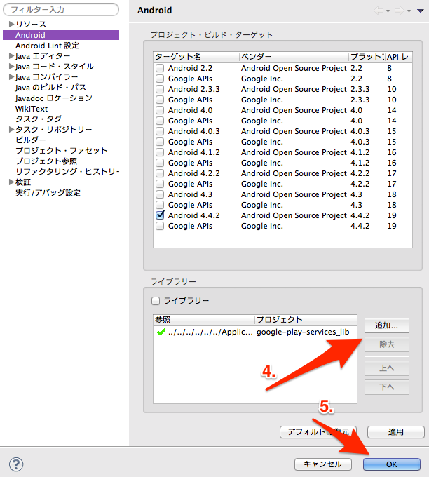
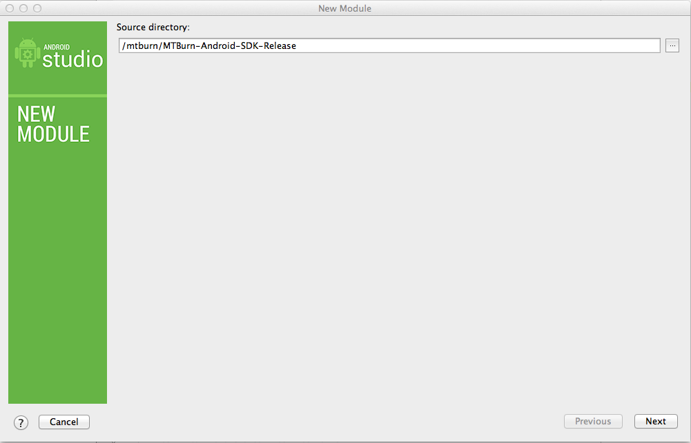
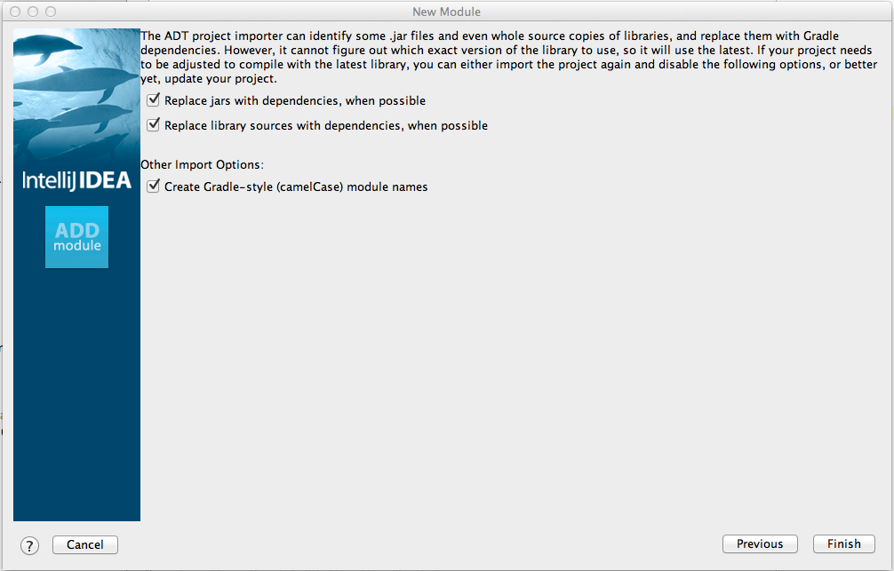

# Table of Contents

* [Supported Environments](#support)
* [Downloading the MTBurn-Android-SDK](#dl)
* [Installing in Eclipse](#eclipse)
	* [Adding the MTBurn-Android-SDK Library](#eclipse/android-sdk)
	* [Adding the GooglePlayService Library](#eclipse/google-play-service)
* [Implementation in Android Studio](#android-studio)
	* [Adding the MTBurn-Android-SDK Library](#android-studio/android-sdk)
	* [Adding the GooglePlayService Library](#android-studio/google-play-service)

This document describes how to add Hike Android SDK (previously AppDavis Android SDK) to Eclipse or Android Studio project, and its use. 

<a name="support"></a>
# Supported Environments

Hike Android SDK runs on Android SDKVersion 8 and above. 

Please let support know if you run into any problems. 

[a@mtburn.com](a@mtburn.com)

<a name="dl"></a>
# Downloading the MTBurn-Android-SDK

Download the Hike Android SDK from the following URL. We recommend that you choose the most recent version. 

[Downloading the Hike Android SDK](https://github.com/mtburn/MTBurn-Android-SDK-Install-Guide/releases)

Once the download is complete, decompress the zip file and confirm the SDK library. 

```
MTBurn-Android-SDK-Release
```

When running the demo application, import the demo directory. 

By adding the MTBurn-Android-SDK library and GooglePlayServicer library in accordance with the following instructions, each function of the SDK can be confirmed. 

<a name="eclipse"></a>
# Installing in Eclipse

<a name="eclipse/android-sdk"></a>
### Add the MTBurn-Android-SDK library

- 1.Select Existing Android Code in Workspace.

- 2.Select Next.


- 3.Browse the root directory and select the downloaded MTBurn-Android-SDK-Release.


- 4.Open properties for the project using MTBurn-Android-SDK and add the MTBurn-Android-SDK-Release library.

- 5.Select OK.


<a name="eclipse/google-play-service"></a>
### Adding the GooglePlayService Library

- 1.Select Existing Android Code in Workspace.

- 2.Select Next


- 3.Browse the root directory and select android-sdk/extras/google/google_play_services/libproject/google-play-services_lib.


- 4.Open the properties of the project using MTBurn-Android-SDK , and add the google-play-services_lib library.
	- This will work with version 4.0 or above. 

- 5.Select OK.




This completes the installation in Eclipse. 

<a name="android-studio"></a>
# Installation in AndroidStudio

<a name="android-studio/android-sdk"></a>
### Adding the MTBurn-Android-SDK Library

- 1.Select File -> Import Module.

- 2.Browse the source/directory and after selecting the downloaded MTBurn-Android-SDK-Release, click Next.


- 3.Confirm the check mark and finish.


- 4.Add the `compile project(":mTBurnAndroidSDKRelease")` under the app/build.gradle dependencies using the MTBurn-Android-SDK.

- 5.Execute Sync Projects with Gradle Files.

<a name="android-studio/google-play-service"></a>
### Adding the GooglePlayService Library

- 1.When the Google Play services SDK is not yet installed, [install from SDK Manager](http://developer.android.com/google/play-services/setup.html)。

- 2.Add `compile 'com.google.android.gms:play-services:6.1.+’` under the app/build.gradle dependencies for the project using MTBurn-Android-SDK
 - This will work with version 4.0 or above. 

- 3.Correct the `minSdkVersion` under app/build.gradle android, defaultConfig for the project using MTBurn-Android-SDK to 9

- 4.Execute Sync Projects with Gradle Files.

This completes installation of Android Studio.
